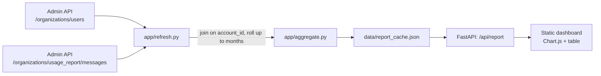

# Claude Admin Usage Reporter

A small, self-hosted dashboard that shows **Claude token usage per organization member, broken down by role and month**, using [Anthropic's Admin API](https://platform.claude.com/docs/en/manage-claude/admin-api).

Built because there's no built-in Console view for "show me token usage for everyone with the `developer` role, per month" — the Admin API can do it, but you have to join two endpoints yourself. This project does that join, caches the result, and puts a small dashboard on top.


## What it does

1. Fetches your organization's members and their roles (`GET /v1/organizations/users` — role is one of `user`, `claude_code_user`, `developer`, `billing`, `admin`).
2. Fetches token usage grouped by `account_id` and `model` (`GET /v1/organizations/usage_report/messages`).
3. Joins the two on `account_id` == user `id`, rolls daily buckets up into calendar months, and estimates a USD cost per row from a static price table.
4. Serves the result as JSON (`/api/report`) and a small dashboard (charts + a sortable table) at `/`.

## Quickstart

```bash
git clone https://github.com/CarstVaartjes/claude-admin-usage-reporter.git
cd claude-admin-usage-reporter
python3 -m venv .venv && source .venv/bin/activate
pip install -r requirements.txt

cp .env.example .env
# edit .env and set ANTHROPIC_ADMIN_KEY=sk-ant-admin-...
# (Console > Settings > Organization > Admin API keys. Requires the `admin` role.)

python -m app.cli refresh      # pulls users + usage, caches to ./data/report_cache.json
python -m app.cli serve        # dashboard at http://localhost:8000
```

Or with Docker:

```bash
cp .env.example .env   # fill in ANTHROPIC_ADMIN_KEY
cp pricing_overrides.yaml.example pricing_overrides.yaml   # optional, see below
docker compose up --build
```

## Architecture



Data is pulled on demand (CLI `refresh` command, or the "Refresh from Admin API" button, which calls `POST /api/refresh`) rather than on every page load, since the usage endpoint returns one row per user per model per day and can be slow to page through for a large org over a long window.

## Configuration

| Env var | Default | Notes |
|---|---|---|
| `ANTHROPIC_ADMIN_KEY` | — (required) | Must start with `sk-ant-admin`. Create one in Console (requires the `admin`/owner role). |
| `ANTHROPIC_API_BASE_URL` | `https://api.anthropic.com` | Override if needed. Note: most Admin API endpoints (including usage/cost reports) are **not available** on Claude Platform on AWS. |
| `ANTHROPIC_VERSION` | `2023-06-01` | `anthropic-version` header. |
| `DEFAULT_MONTHS_BACK` | `6` | How far back `refresh` pulls by default; override with `--months`. |
| `DATA_DIR` | `./data` | Where the cache file lives. |

To correct token pricing for your org's actual rate (volume/enterprise pricing differs from list price), copy `pricing_overrides.yaml.example` to `pricing_overrides.yaml` and set per-model rates. It's gitignored so you don't accidentally commit negotiated pricing.

## Limitations

Read this before trusting the numbers for anything important:

- **Cost is an estimate, not your invoice.** The Admin API's `cost_report` endpoint (the one that reflects actual billed cost) can only be grouped by `description` or `workspace_id` — **not** by user/`account_id`. There is currently no Admin API endpoint that returns "$ spent by this specific person." To show a per-user dollar figure at all, this tool multiplies each user's token counts (which the API *does* break down by `account_id`) by a static price table in `app/pricing.py`. If Anthropic changes prices, or your org is on non-list pricing, this will drift from reality. **The token counts themselves come directly from the Admin API and are accurate**; only the dollar conversion is an estimate.
- **Removed/deactivated members.** Historical usage rows keep their original `account_id` even after someone leaves the org, but `/v1/organizations/users` only lists current members. Usage from an `account_id` with no matching current user shows up in the dashboard with role `"unknown"` (see the yellow banner) rather than being silently dropped.
- **Role is an org-level snapshot.** `role` reflects the user's *current* role, not their role at the time the usage occurred. If someone was promoted from `user` to `developer` mid-month, that month's usage is attributed to whatever their role is *now*.
- **Not available on Claude Platform on AWS.** Per Anthropic's docs, usage/cost report endpoints only work with a standard Anthropic Admin API key, not on Bedrock/Vertex deployments.
- **Rate limits.** The client retries on 429s with backoff, but a large org over a long time window means a lot of pages; the CLI `refresh` step can take a while.

## Development

```bash
pip install -r requirements-dev.txt
ruff check app tests
pytest
```

Tests mock the Admin API (via `responses`) and cover pagination, retry-on-429, and the aggregation/pricing logic — no live API key or network access needed to run the suite.

## License

MIT — see [LICENSE](LICENSE).
